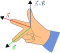

# Chapitre I : Mathématiques de Base pour le Mécanicien Amateur

Comment représenter le monde qui nous entoure pour résoudre des problèmes ?

La mécanique utilise des outils mathématiques pour décrire et prédire le comportement des systèmes physiques sous différentes conditions. Dans ce chapitre, nous posons les bases de cette représentation, en introduisant les **scalaires** et en abordant les notions fondamentales de **grandeurs physiques** et d’**analyse dimensionnelle**. Ces concepts sont cruciaux pour aborder les prochaines étapes, où nous explorerons les **vecteurs** et leurs applications en mécanique.

## 1. Les Scalaires

En mathématiques, un **scalaire** est un objet mathématique qui est entièrement décrit par la valeur de sa magnitude. Les scalaires sont donc représenté par de **nombres réels** ($\mathbb{R}$). En mécanique, les scalaires représentent des **quantités physiques** mesurables qui n'ont pas de direction associée, mais uniquement une **magnitude** (ou grandeur). Ils sont utilisés pour décrire des propriétés fondamentales telles que la **masse**, le **temps**, ou la **température**.

Ainsi, en considérant les scalaires comme des valeurs de $\mathbb{R}$, nous pouvons effectuer des opérations classiques comme l’addition, la soustraction ou la multiplication de scalaires, sans se préoccuper d’une orientation spatiale.

!!! quote "In english please !"
    **Scalar**: a quantity represented as a real number ($\mathbb{R}$) that has magnitude but no direction, used to describe physical properties like mass, time, and temperature.

## 2. Grandeurs Physiques et Unités

Les scalaires réprésentent souvent des **grandeurs physiques** et nécessitent des unités pour quantifier leur valeur. Ces grandeurs sont des propriétés d’un objet ou d’un phénomène qui peuvent être mesurées, telles que la **longueur**, la **masse**, ou la **vitesse**. Par exemple :

- La longueur est mesurée en **mètres** (m),
- La masse en **kilogrammes** (kg),
- Le temps en **secondes** (s).

Pour normaliser et faciliter les échanges de données et les calculs, les grandeurs physiques sont exprimées dans le cadre du **Système International d'Unités (SI)**.

### 2.1 Système International d'Unités (SI)

Le **Système International d'Unités (SI)** fournit une base cohérente pour la mesure des grandeurs. Les unités SI des grandeurs physiques principales sont résumées ci-dessous :

| **Grandeur**              | **Symbole de l'unité** | **Nom de l'unité** |
|---------------------------|------------------------|---------------------|
| Longueur                  | m                      | Mètre              |
| Masse                     | kg                     | Kilogramme         |
| Temps                     | s                      | Seconde            |
| Température               | K                      | Kelvin             |
| Courant électrique        | A                      | Ampère             |
| Quantité de matière       | mol                    | Mole               |
| Intensité lumineuse       | cd                     | Candela            |

Certaines unités dérivées peuvent s’exprimer à partir des **unités de base du système SI** en combinant celles-ci selon des relations mathématiques spécifiques. Par exemple, l’unité de **force**, le **Newton** (N), se décompose en termes de kilogrammes, mètres, et secondes, puisqu’il correspond à la **force nécessaire pour accélérer une masse d'un kilogramme à une vitesse d’un mètre par seconde carré**.

\[
\text{N} = \text{kg} \cdot \frac{\text{m}}{\text{s}^2}
\]

Cette décomposition permet de comprendre que le Newton est en réalité une unité composite, construite à partir des unités de masse, longueur, et temps.

Ce principe s’applique également à d’autres unités physiques, telles que :

- Le **Joule** (J), unité d’énergie, qui s’exprime comme un Newton mètre \((\text{N} \cdot \text{m})\) ou, de façon équivalente, en \(\text{kg} \cdot \frac{\text{m}^2}{\text{s}^2}\).
- Le **Watt** (W), unité de puissance, qui est défini comme un Joule par seconde \((\text{J/s})\), soit également \(\text{kg} \cdot \frac{\text{m}^2}{\text{s}^3}\).

Ces relations montrent comment les unités dérivées peuvent se ramener aux unités de base, facilitant ainsi les calculs et la vérification de la cohérence dimensionnelle dans les équations. Nous verrons plus tard à quoi servent ses équations. Mais avant de les apprendre par coeur, notons qu'il existe une méthode infaillible pour tirer profit du système SI.

## 3. L’Analyse Dimensionnelle

L'**analyse dimensionnelle** est un outil qui permet de vérifier la cohérence des équations physiques en se basant sur les unités. En décomposant chaque grandeur en ses dimensions fondamentales (longueur, masse, temps, etc.), on peut évaluer la validité d’une équation ou même esquisser la structure de certaines formules.

### 3.1 Principe de l’Analyse Dimensionnelle

Une règle clé est que les deux côtés d'une équation doivent avoir les **mêmes dimensions**. Prenons l’exemple de la vitesse, exprimée par :

\[
v = \frac{d}{t}
\]

où :
- $v$ représente la **vitesse** (en mètres par seconde, m/s),
- $d$ est la **distance** (en mètres, m),
- $t$ est le **temps** (en secondes, s).

Les dimensions de chaque terme sont :

\[
[v] = \frac{\text{m}}{\text{s}}, \quad [d] = \text{m}, \quad [t] = \text{s}
\]

Ce calcul montre que les dimensions de la vitesse \((\text{m/s})\) sont cohérentes avec la définition physique.

!!! quote "In english please !"
    **Dimensional analysis**: a method to verify the consistency of physical equations by checking the fundamental units on each side of the equation.

### 3.2 Applications de l’Analyse Dimensionnelle

L'analyse dimensionnelle nous permet de :

- **Vérifier la cohérence** des équations,
- **Deviner des formules** en se basant sur les dimensions des grandeurs,
- **Interpréter les phénomènes physiques** par le prisme des dimensions fondamentales.

!!! tip "Les tips de top-top"
    Lors d’un examen, maîtriser l’analyse dimensionnelle peut permettre de vérifier la validité d’une formule sans la mémoriser intégralement. Cette méthode pourra vous sortir de situations délicate en examens !

### 3.3 Exemples Pratiques

1. **Énergie cinétique** : L'énergie cinétique $E$ est donnée par :

\[
E = \frac{1}{2}mv^2
\]

où $m$ est la masse (kg) et $v$ la vitesse (m/s). En termes de dimensions :

\[
[E] = \text{kg} \cdot \left( \frac{\text{m}}{\text{s}} \right)^2 = \text{kg} \cdot \frac{\text{m}^2}{\text{s}^2} = \text{Joule (J)}
\]

2. **Force** : La force $F$ est définie par la seconde loi de Newton : $F = ma$, où $m$ est la masse et $a$ l'accélération.

\[
[F] = \text{kg} \cdot \frac{\text{m}}{\text{s}^2} = \text{Newton (N)}
\]

!!! example "Exercice"
    === "Question"
        Supposons qu'une force $F$ agit sur un objet et que cette force déplace l'objet sur une distance $d$. Quelle unité obtient-on en multipliant $F$ par $d$ ? 

    === "Solution"
        En multipliant une force (en Newtons) par une distance (en mètres), on obtient des **joules (J)**, unité de l'énergie, car :

        \[
        F \times d = \text{N} \cdot \text{m} = \text{J}
        \]

        Ce résultat correspond au travail effectué par la force sur la distance $d$.

Ces exemples montrent l’utilité de l’analyse dimensionnelle pour valider les expressions mathématiques et physiques.

---

## 4. Les Vecteurs

Dans les sections précédentes, nous avons étudié les **scalaires**, des quantités définies dans l'ensemble des réels $\mathbb{R}$, c'est-à-dire dans un espace à une dimension. Cependant, pour représenter pleinement les phénomènes du monde réel, il est nécessaire de pouvoir décrire des grandeurs qui possèdent à la fois une magnitude, une **direction** et un **sens**. C'est ici que les **vecteurs** interviennent : ils fournissent un cadre mathématique pour modéliser ces grandeurs multidimensionnelles.

### 4.1 Définition

Un **vecteur** est un objet mathématique caractérisé par plusieurs propriétés fondamentales, qui lui permettent de représenter des grandeurs telles que le déplacement, la vitesse, l’accélération, ou la force.

1. **Direction** : La ligne d’action du vecteur, qui décrit l’orientation dans laquelle la grandeur s’applique.
2. **Sens** : Le sens du vecteur correspond au côté de la ligne d’action vers lequel le vecteur pointe.
3. **Magnitude (ou Norme)** : La longueur du vecteur, souvent notée $||\vec{V}||$ ou $|\vec{V}|$. Cette quantité positive correspond à la grandeur de la force, de la distance, etc., souvent exprimée en unités physiques (comme les mètres pour la distance ou les newtons pour une force).
4. **Point d’Application** : Le point d’origine du vecteur, à partir duquel il agit.

Dans le cadre de la mécanique, nous considérons les vecteurs dans des espaces à deux ou trois dimensions, notés respectivement $\mathbb{R}^2$ et $\mathbb{R}^3$. Mathématiquement, un vecteur dans ces espaces peut être représenté par une suite ordonnée de **composantes indépendantes** qui déterminent une position dans l’espace ou un déplacement par exemple. Dans $\mathbb{R}^3$, un vecteur $\vec{V}$ est défini par ses composantes dans les directions $x$, $y$, et $z$ :

\[
\vec{V} = (V_x, V_y, V_z)
\]

où $V_x$, $V_y$, et $V_z$ sont des **scalaires indépendants** qui représentent les projections du vecteur sur chacun des axes de coordonnées. Cette notation nous permet de manipuler les vecteurs de manière algébrique et de réaliser des opérations telles que l'addition, la soustraction, et la multiplication par un scalaire.

Les vecteurs appartiennent à une structure mathématique plus large appelée **espace vectoriel**. Un espace vectoriel est un ensemble de vecteurs où deux opérations sont possibles : l'addition de vecteurs et la multiplication par un scalaire. 

L'**addition de vecteurs** permet de combiner deux vecteurs pour en obtenir un troisième. Cette addition a des propriétés qui simplifient les calculs : elle est associative et commutative, ce qui signifie que l’ordre d’addition n’importe pas, et chaque vecteur possède un opposé qui, additionné à lui-même, donne un vecteur nul (l'équivalent du zéro).

La **multiplication par un scalaire** signifie qu’on peut ajuster la longueur d’un vecteur en le multipliant par un nombre (un scalaire), sans modifier sa direction ou en inversant celle-ci si le nombre est négatif. Cette opération est également distributive et associative, et le vecteur reste inchangé si on le multiplie par 1, le scalaire neutre.

Un espace vectoriel permet de manipuler des vecteurs comme des flèches dans l’espace, mais aussi des objets abstraits comme des fonctions, des suites, et des matrices, rendant cette structure très puissante pour l’étude de concepts variés en science et en ingénierie.

### 4.2 Types de Vecteurs

Les vecteurs se distinguent par leur point d’application et le rôle qu’ils jouent dans la modélisation des phénomènes physiques. Par exemple, un vecteur peut représenter une force ou une position, définie soit par rapport à l’origine d’un système de coordonnées, soit par rapport à un autre objet. Ce **point d'application** influence alors la façon dont le vecteur agit sur le système. Cependant, dans certains cas, la position du point d’application n'a pas d'importance ; par exemple, une force appliquée sur un solide rigide peut glisser le long de sa ligne d’action sans modifier l'état du solide.

Voici les principaux types de vecteurs selon ces caractéristiques :

- **Vecteurs Liés** : Ces vecteurs sont attachés à un point d’application fixe. Par exemple, une force appliquée en un point précis d’un objet est un vecteur lié, car son effet dépend de ce point d’application spécifique.
- **Vecteurs Glissants** : Les vecteurs glissants peuvent se déplacer le long de leur ligne d’action sans modifier l’effet qu’ils produisent. Par exemple, une force appliquée sur un solide rigide est un vecteur glissant : si sa direction passe par le centre de gravité de l’objet, son point d’application le long de cette ligne d’action n’entraînera aucune rotation supplémentaire et son effet restera le même.
- **Vecteurs Libres** : Les vecteurs libres n’ont pas de point d’application spécifique ; ils sont définis uniquement par leur magnitude et leur direction. En mathématiques, les vecteurs sont souvent traités comme libres, ce qui permet de simplifier les calculs sans avoir à considérer leur point d’origine.
Ces distinctions permettent de modéliser les vecteurs de façon adaptée aux contextes physiques et mathématiques, en tenant compte de leurs effets réels sur le système étudié.

### 4.3 Représentation des Vecteurs

Un vecteur peut être représenté de différentes manières. Géométriquement, il est représenté par une flèche dans l'espace, avec une longueur proportionnelle à la norme du vecteur, une direction et un sens.

{.center}

Algébriquement on peut representer un vecteur en le décomposant suivant la base de notre espace. La plupart du temps nous utiliserons des **Coordonnées Cartésiennes** : Dans un espace à $n$ dimensions, un vecteur est défini par ses composantes selon les axes du système de coordonnées. Par exemple, dans $\mathbb{R}^3$, un vecteur $\vec{V}$ est représenté par :

$$
\vec{V} = (V_x, V_y, V_z)
$$

où $V_x$, $V_y$, et $V_z$ sont les projections de $\vec{V}$ sur les axes $x$, $y$, et $z$.

---

### 4.4 Opérations sur les Vecteurs

Les vecteurs obéissent à des règles d'opérations spécifiques, qui permettent de les manipuler mathématiquement.

#### 4.4.1 L'addition

L'addition de deux vecteurs $\vec{A}$ et $\vec{B}$ donne un vecteur résultant $\vec{C} = \vec{A} + \vec{B}$.

Règle du Parallélogramme : Géométriquement, on place les vecteurs de telle sorte que l'origine de $\vec{B}$ coïncide avec l'extrémité de $\vec{A}$. Le vecteur résultant est alors la diagonale du parallélogramme formé.

{.center}

L'addition peut aussi s'effectuer algébriquement en additionnant simplement les composantes des vecteurs. Soit $\vec{A} = (A_x, A_y, A_z)$ et $\vec{B} = (B_x, B_y, B_z)$, deux vecteurs, alors :

$$
\vec{C} = \vec{A} + \vec{B} = (A_x + B_x, \ A_y + B_y, \ A_z + B_z)
$$

#### 4.4.2 La soustraction

La **soustraction** de vecteurs est définie comme l'addition du vecteur opposé :

$$
\vec{A} - \vec{B} = \vec{A} + (-\vec{B})
$$

Où $-\vec{B}$ est le vecteur opposé de $\vec{B}$, ayant la même magnitude mais une direction opposée.

#### 4.4.3 Multiplication d'un Vecteur par un Scalaire

La multiplication d'un vecteur $\vec{V}$ par un scalaire $\alpha \in \mathbb{R}$ produit un vecteur $\alpha \vec{V}$ dont la magnitude est multipliée par $|\alpha|$ et dont la direction reste la même si $\alpha > 0$ ou est inversée si $\alpha < 0$.

#### 4.4.4 Produit Scalaire (Produit Intérieur)

Le **produit scalaire** entre deux vecteurs $\vec{A}$ et $\vec{B}$ est une opération qui associe deux vecteurs à un scalaire :

$$
\vec{A} \cdot \vec{B} = ||\vec{A}|| \ ||\vec{B}|| \ \cos(\theta)
$$

Où $\theta$ est l'angle entre $\vec{A}$ et $\vec{B}$. En coordonnées cartésiennes :

$$
\vec{A} \cdot \vec{B} = A_x B_x + A_y B_y + A_z B_z
$$

Le produit scalaire mesure la projection de l'un des vecteurs sur l'autre. Comme sont nom l'indique, le résultat est un scalaire !

#### 4.4.5 Produit Vectoriel (Produit Extérieur)

Le **produit vectoriel** entre deux vecteurs $\vec{A}$ et $\vec{B}$ dans $\mathbb{R}^3$ est un vecteur $\vec{C} = \vec{A} \times \vec{B}$ dont la magnitude est donnée par :

$$
||\vec{C}|| = ||\vec{A}|| \ ||\vec{B}|| \ \sin(\theta)
$$

La direction de C est toujours orthogonale (perpendiculaire) au plan formé par $\vec{A}$ et $\vec{B}$, selon la règle de la main droite.

{.center}

Il est toutefois plus commun de calculer le produit vectoriel en utilisant les composantes individuelles des vecteurs (coordonnées) en utilisant la formule suivante :

$$
\vec{C} = (A_y B_z - A_z B_y, \ A_z B_x - A_x B_z, \ A_x B_y - A_y B_x)
$$

Le produit vectoriel est utilisé pour calculer des moments, des couples, et est essentiel en mécanique pour analyser les rotations et les forces perpendiculaires.

Pour simplifier le calcul et retrouver l'équation vous pouvez utiliser la méthode suivante : 

1. Écrivez les vecteurs en colonnes et ajoutez une colonne vide pour le résultat :

\[
\begin{array}{c|c|c}
    A_x & B_x & ? \\
    A_y & B_y & ? \\
    A_z & B_z & ? \\
\end{array}
\]

2. Barrez la premières lignes et réécrivez-les en bas, puis calculer la composante $x$ du résultat :

{.img-small .center}

3. Répéter pour les colonnes $y$ et $z$ :

{.img-small .center}

{.img-small .center}

Cette méthode rend le calcul plus intuitif et aide à visualiser les produits croisés nécessaires pour obtenir le produit vectoriel.

### 4.5 Propriétés Algébriques

Les vecteurs obéissent à des propriétés algébriques similaires à celles des nombres réels, mais adaptées à leurs caractéristiques multidimensionnelles.

#### Propriétés de l'Addition : 

- **Commutativité** : $\vec{A} + \vec{B} = \vec{B} + \vec{A}$

- **Associativité** : $(\vec{A} + \vec{B}) + \vec{C} = \vec{A} + (\vec{B} + \vec{C})$

- **Élément Neutre** : Il existe un vecteur nul $\vec{0}$ tel que $\vec{A} + \vec{0} = \vec{A}$

- **Inverse Additif** : Pour tout vecteur $\vec{A}$, il existe un vecteur $-\vec{A}$ tel que $\vec{A} + (-\vec{A}) = \vec{0}$

#### Propriétés de la Multiplication par un Scalaire

- **Associativité** : $(\alpha \beta) \vec{A} = \alpha (\beta \vec{A})$

- **Distributivité sur les Vecteurs** : $\alpha (\vec{A} + \vec{B}) = \alpha \vec{A} + \alpha \vec{B}$

- **Distributivité sur les Scalaires** : $(\alpha + \beta) \vec{A} = \alpha \vec{A} + \beta \vec{A}$

- **Élément Neutre** : $1 \vec{A} = \vec{A}$

Ces propriétés permettent de manipuler les vecteurs de manière algébrique et sont essentielles pour le développement de l'algèbre vectorielle.

## 5. Bases et Composantes des Vecteurs

Dans un espace vectoriel, les vecteurs peuvent être exprimés en termes de **bases**.

### 5.1 Base de l'Espace Vectoriel

Une **base** d'un espace vectoriel $V$ est un ensemble de vecteurs $\{\vec{e}_1, \vec{e}_2, \dots, \vec{e}_n\}$ linéairement indépendants qui engendrent $V$. Tout vecteur $\vec{V} \in V$ peut être exprimé comme une combinaison linéaire de ces vecteurs :

$$
\vec{V} = v_1 \vec{e}_1 + v_2 \vec{e}_2 + \dots + v_n \vec{e}_n
$$

où $v_i \in \mathbb{R}$ sont les **composantes** du vecteur $\vec{V}$ dans la base choisie.

### 5.2 Composantes dans une Base Orthonormée

Dans une base orthonormée (les vecteurs de base sont orthogonaux entre eux et de norme unitaire), les calculs de produits scalaires et de normes sont simplifiés.

- **Produit Scalaire** :

$$
\vec{A} \cdot \vec{B} = \sum_{i=1}^{n} A_i B_i
$$

- **Norme du Vecteur** :

$$
||\vec{A}|| = \sqrt{\vec{A} \cdot \vec{A}} = \sqrt{\sum_{i=1}^{n} A_i^2}
$$

Cette représentation facilite les calculs algébriques et analytiques en mécanique et en physique.
