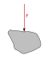
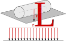
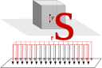
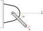
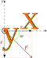

# Chapitre II : Analyse statique

En analyse statique, on étudie les corps au repos ou en mouvement à vitesse constante, autrement dit, les corps soumis à un équilibre des forces. Dans un système statique, la somme des forces et des moments est nulle, ce qui signifie que le corps ne subit aucune accélération.

Les forces appliquées sur un objet au repos peuvent être de différentes natures : poids, forces de contact, forces de tension, et forces de frottement. L'objectif est d'analyser ces forces pour garantir la stabilité des structures, essentiel dans les domaines de l’ingénierie et de la conception.

## 1. Les forces

La **force** est une grandeur vectorielle représentée par un vecteur (trois caractéristiques) :

- **Direction** : la ligne d’action de la force.
- **Sens** : vers où la force est dirigée.
- **Intensité** : la magnitude de la force, mesurée en Newtons (N, daN, ...).

!!! quote "In english please !"
    **Force Vector**: A vector quantity with magnitude, direction, and sense, measured in newtons (N).

Dans le contexte de la statique, chaque force appliquée sur un objet doit être équilibrée par d'autres forces pour maintenir cet objet en repos. Par exemple, un livre posé sur une table est soumis à deux forces : son poids (vers le bas) et une force de réaction de la table (vers le haut).

### 1.2 Actions mécaniques

Les actions mécaniques regroupent l’ensemble des forces appliquées à un système étudié. Elles sont classées en deux grandes catégories : les **actions à distance** et les **actions de contact**. Ces actions influencent le comportement d'un objet et son équilibre, et leur modélisation est cruciale pour les analyses statiques et dynamiques.

Les actions à distance sont des forces exercées sur un objet sans contact direct avec celui-ci. Elles résultent d’interactions de champ, où une force est appliquée sur l'ensemble du volume ou de la masse d'un solide.

**Poids (Force de gravité)** : Le poids est une force à distance exercée par la Terre sur tout objet ayant une masse. Sa direction est verticale, orientée vers le centre de la Terre.

\[
\vec{P} = m \cdot \vec{g}
\]

où :

- \( m \) est la masse de l'objet (en kg),
- \( \vec{g} \) est le vecteur d'accélération gravitationnelle (\( g \approx 9,81 \, \text{m/s}^2 \)).

**Forces électromagnétiques** : Les forces électromagnétiques s’exercent sur des particules chargées, comme les électrons et les protons. En mécanique classique, elles sont moins courantes pour les solides macroscopiques, mais elles peuvent jouer un rôle dans les objets conducteurs.

---

Les actions de contact résultent de l’interaction directe entre deux objets. Elles nécessitent un point ou une surface de contact et sont classées selon la géométrie et la nature du contact.

**Action de contact ponctuelle** : Il s’agit d’une force exercée en un point spécifique d'un solide, comme le point de contact entre une bille et une surface plane. La force est modélisée par un vecteur appliqué en ce point.

{.center}

\[
\vec{F} = F \cdot \vec{u}
\]

où :

- \( F \) est l'intensité de la force,
- \( \vec{u} \) est le vecteur unitaire dans la direction de la force.

**Action de contact linéique** : Cette force est appliquée le long d’une ligne de contact, comme une corde tendue ou le bord d’une surface en appui. La force linéique est souvent exprimée par une densité de force par unité de longueur, \( f_L \), et appliquée le long de la ligne de contact.

{.center}

\[
\vec{F}_L = f_L \cdot L \cdot \vec{u}
\]

où :

- \( f_L \) est la force linéique (en N/m),
- \( L \) est la longueur du contact.

**Pression superficielle** : Lorsqu’une force est distribuée sur une surface, elle est décrite par une pression, exprimée en force par unité de surface. Par exemple, la pression appliquée par un fluide sur les parois d’un réservoir ou la pression entre une semelle de chaussure et le sol.

{.center}

\[
\vec{F}_S = p \cdot A \cdot \vec{n}
\]

où :

- \( p \) est la pression (en Pa ou N/m²),
- \( A \) est l'aire de la surface de contact,
- \( \vec{n} \) est le vecteur normal à la surface.

Les liaisons mécaniques créent des interactions de contact qui limitent les degrés de liberté d’un solide en fonction de son environnement. Selon le type de liaison, la nature et la direction des forces varient. Nous étudierons ces actions spécifique plus tard dans le cours.

### 1.3 Propriétés vectoriel des forces

Les forces étant représentée grâce à des vecteurs, il est possible d'utiliser toutes les propriétés de l'analyse vectorielle pour résoudre des problèmes en mécanique. 
Ainsi à titre d'exemple, les forces s'exerçant sur un solide peuvent être décomposer en plusieurs composantes de leur base.

{.center}

Dans l'exemple ci-dessus, il est possible d'obtenir la composante de $\vec{F}$ selon $\vec{x}$ en effectuant une projection.

$$
F_x = ||\vec{F}|| \cdot cos(30°)
$$

{.center}

### 1.4 Hypothèse des solides indéformables

Dans l’étude des systèmes mécaniques, on adopte souvent l’hypothèse que les solides sont **indéformables**, c'est-à-dire qu'ils conservent leur forme et leur volume sous l'effet des forces appliquées. Cette hypothèse simplificatrice implique que les distances entre les points d’un solide restent constantes, même lorsqu'il est soumis à des charges externes. Cela signifie que, quel que soit l’endroit où une force est appliquée, le solide ne subit ni étirement, ni compression, ni torsion, ni flexion.

L'hypothèse des solides indéformables est particulièrement adaptée aux structures rigides et aux mécanismes de petite échelle où les déformations sont négligeables par rapport aux dimensions de l’objet. Par exemple, pour les pièces en métal d'un châssis de voiture ou d'une structure métallique, les déformations sous charge modérée peuvent être assez petites pour justifier cette hypothèse.

### 2. Force résultante

En statique, il est souvent nécessaire de simplifier l’analyse en regroupant toutes les forces appliquées sur un solide sous forme d’une **force résultante**. La force résultante est un vecteur unique qui a le même effet global que l’ensemble des forces individuelles appliquées sur l’objet. Elle résume l’influence de toutes les forces en une seule force appliquée en un point particulier du solide, souvent choisi comme le centre de gravité.

En effet, puisque le solide est indeformable (hypothèse 1.1), il est possible de décrire les forces qui s'exercent sur celui si en tout point du solide à l'aide d'une force et d'un moment.

La détermination de la force résultante est essentielle pour l’analyse statique, car elle permet de :

1. Simplifier les calculs en réduisant plusieurs forces à une seule.
2. Évaluer l’équilibre statique d’un objet : si la force résultante est nulle, l’objet ne subit pas d'accélération linéaire.
3. Analyser les effets combinés de plusieurs forces avec une approche vectorielle, en tenant compte des directions et des intensités de chaque force.

La force résultante \( \vec{R} \) est obtenue en additionnant vectoriellement toutes les forces appliquées sur l'objet. Mathématiquement, si un solide est soumis à \( n \) forces \( \vec{F_1}, \vec{F_2}, ..., \vec{F_n} \), la force résultante s'exprime par :

\[
\vec{R} = \sum_{i=1}^{n} \vec{F_i}
\]

Cette addition vectorielle tient compte non seulement de la magnitude de chaque force, mais aussi de leur direction et de leur point d'application relatif. Dans le cas de forces colinéaires, la résultante est simplement la somme algébrique de leurs intensités, dans leur direction commune.

### 2.1 Forces concurrentes 

Lorsque plusieurs forces convergent vers un même point, on peut les additionner directement pour déterminer la force résultante. Par exemple, si trois câbles appliquent des forces à un même point sur une structure, on peut calculer la force résultante en additionnant les vecteurs des forces de chaque câble.
   
schéma et exemple

### 2.2 Forces parallèles

Pour des forces parallèles appliquées sur un solide, la force résultante est la somme vectorielle des forces, mais le point d'application de la résultante dépend de la répartition des forces et de leurs distances par rapport à un point de référence.

schéma est explication du point d'application de la résultante

#### Types de forces :

- **Poids** : La force exercée par la gravité sur un objet, dirigée vers le centre de la Terre. Sa magnitude est donnée par \( P = m \cdot g \), où \( m \) est la masse de l'objet et \( g \approx 9,81 \, \text{m/s}^2 \).
- **Force normale** : La force de réaction exercée perpendiculairement par une surface sur un objet en contact.
- **Force de frottement** : Force opposant le mouvement relatif entre deux surfaces en contact.
- **Force de tension** : Force transmise par un câble, une corde ou une chaîne tirant sur un objet.

!!! example "Exercice"
    === "Question"
        Un objet de 5 kg est posé sur une surface plane. Calculez le poids de cet objet et identifiez les forces en équilibre.

    === "Solution"
        Le poids est donné par \( P = m \cdot g \) :

        \[
        P = 5 \, \text{kg} \times 9,81 \, \text{m/s}^2 = 49,05 \, \text{N}
        \]

        Les forces en équilibre sont le poids (vers le bas) et la force normale de la surface (vers le haut), de même intensité que le poids.

!!! tip "Les tips de top-top"
    Il est courant d'utiliser le daN comme unité pour décrire un poids. En effet, le champ de pesanteur $g \approx 10 m.s^{-2}$ ce qui signifie qu'un objet de 200kg possède un poids d'environ 200 daN. Évidemment il est parfois neccessaire d'utiliser les valeurs exact du poids d'un objet, lorsque l'on étudie l'équilibre d'une balance par exemple.

### 2. Le contact

Lorsque deux objets sont en contact, ils exercent des forces l'un sur l'autre. En mécanique, ces forces sont rarement concentrées en un seul point, car chaque objet a une certaine surface de contact, même à l'échelle microscopique.

La **pression** est la mesure de la force exercée par unité de surface. Elle est particulièrement importante dans les contacts solides, car elle détermine comment les matériaux réagissent aux forces appliquées, affectant la stabilité et la résistance des structures.

\[
\text{Pression} = \frac{\text{Force}}{\text{Surface}} \quad \text{en Pascal (Pa)}
\]

!!! quote "In english please !"
    **Pressure**: The amount of force per unit area exerted on a surface, measured in pascals (Pa).

#### Exemples de forces de contact :
- **Force de frottement** : Oppose le mouvement entre deux surfaces en contact.
- **Force de compression** : Agit sur un objet pour le comprimer.
- **Force de traction** : Tente d’étirer un objet en le tirant.

!!! example "Exercice"
    === "Question"
        Une force de 200 N est appliquée perpendiculairement sur une surface de 0,1 m². Calculez la pression exercée sur cette surface.

    === "Solution"
        La pression est calculée par \( P = \frac{F}{A} \) :

        \[
        P = \frac{200 \, \text{N}}{0,1 \, \text{m}^2} = 2000 \, \text{Pa}
        \]

## 3. Le moments

bras de levier, 

## 4. Résultante

Les forces qui agissent sur un solide peuvent être exprimée comme une force résultante et un moment resultant en tout point d'un solide. Généralement on exprime cette résultante au centre de gravité.

Résultante de forces concurrantes

Résultante de forces parallèles

Résultante de forces cas général
Moment + force resultantes

## 5. Principe fondamental de la statique

somme des force
somme des moments

