# TP 2 : Simulation FEM d'une poutre IPN en acier galvanisé

## Objectif

Dans ce TP, vous allez apprendre à utiliser le module simulation de 3DExperience. Nous allons modéliser une poutre IPN, lui attribuer un matériau avec les propriétés de l'acier galvanisé, et à effectuer une analyse statique simple via l'application Static Study. L'analyse portera sur la distribution de contraintes, notamment selon le critère de Von Mises.

## Étapes du TP
### 1. Modélisation de la poutre IPN avec Part Design

Nous allons commencer par la modélisation de la poutre IPN.

1. Ouvrir l'application **Part Design**.
2. Créer un nouveau produit pour la poutre.
3. Dessiner le profil de la poutre IPN en se basant sur le schéma de cotation fourni. Les dimensions sont disponibles dans le fichier PDF suivant :  
   
[Télécharger le schéma de cotation](./images/tp.rdm/dim.pdf){.md-button}

4. Extruder le profil sur une longueur de **2,8** m afin d'obtenir la poutre.

---

### 2. Matériau de simulation (Acier galvanisé)

1. Passer à l'application **Assembly Design** en réalisant un double-clic sur votre produit (à la racine de l'arbre de conception).
2. Créer un nouveau matériau :
   - Naviguer dans le menu pour trouver l'option de création d'un **nouveau matériau**.
   - Ouvrir le panneau d'édition pour définir les propriétés du matériau. (Voir les captures d'écran correspondantes pour guider l'opération) :

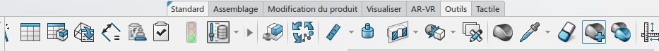

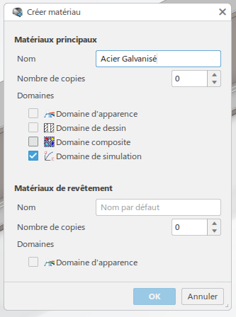

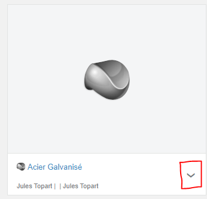

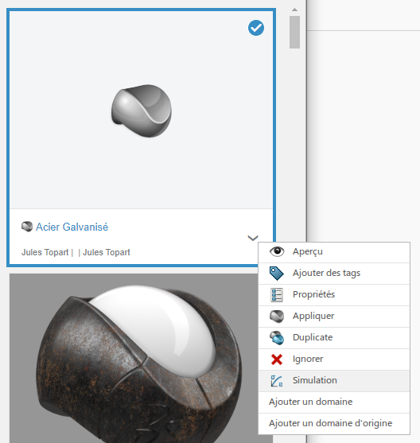

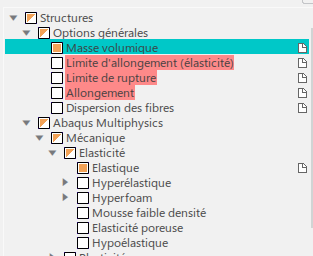

1. Rechercher sur Internet les propriétés mécaniques de l'acier galvanisé (module d'élasticité, coefficient de Poisson, densité, limite d'élasticité, etc.).
2. Saisir les propriétés trouvées dans les champs correspondants.
3. Sauvegarder le matériau créé.
4. Appliquer ce matériau à la poutre :

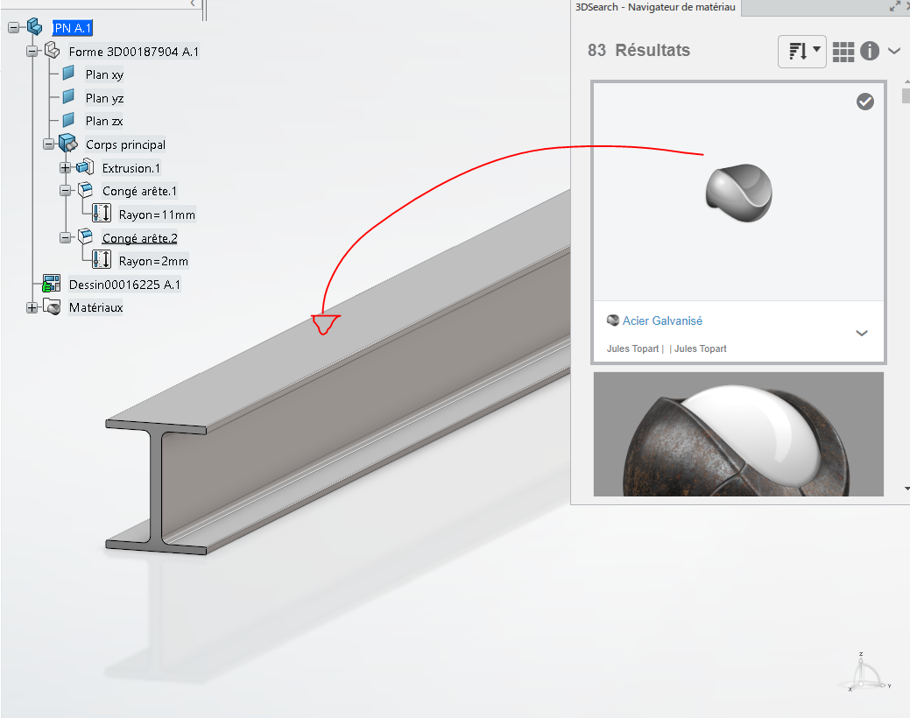

---

### 3. Préparation de l’étude statique avec Static Study

1. Ouvrir l'application **Static Study**.

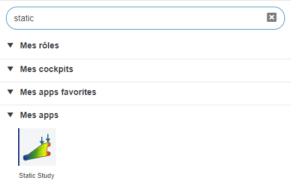

1. Utiliser l'assistant de simulation pour guider les étapes :

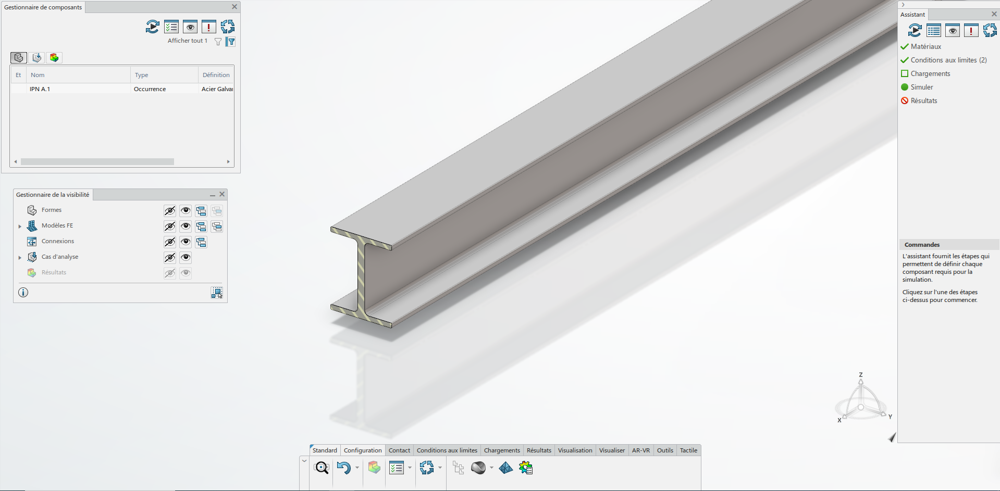

3. Suivre les instructions de l'assistant pour configurer la simulation.

---

### 4. Application des conditions aux limites et chargement
#### 1. Encastrement :

- Sélectionner une des extrémités de la poutre.
- Appliquer un encastrement pour fixer cette extrémité.

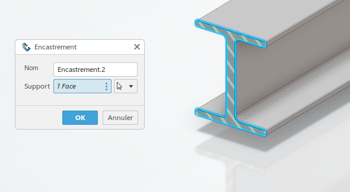

#### 2. Déplacement imposé :

À l'autre extrémité de la poutre, imposer un déplacement de 1 mm.

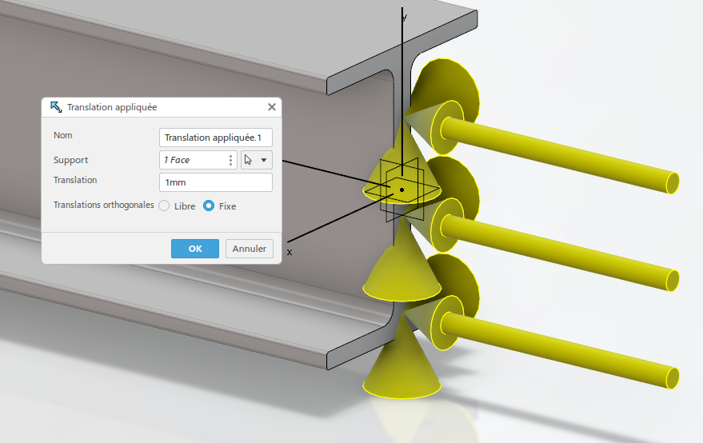

#### 3. Maillage et simulation

1. Mailler la géométrie :

   - Ajuster la taille des éléments si nécessaire pour une bonne résolution.
  
2. Lancer la simulation statique.
3. Une fois la simulation terminée, afficher les résultats :

4. Visualiser le critère de Von Mises pour observer la distribution des contraintes dans la poutre.

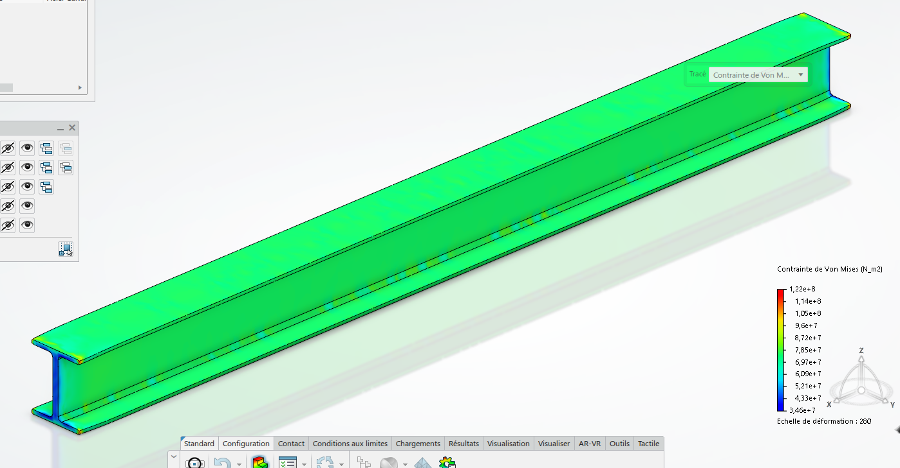

---

## Conclusion
À la fin de ce TP, les étudiants auront acquis les compétences pour :
- Modéliser une poutre en utilisant Part Design.
- Créer et attribuer un matériau personnalisé dans Assembly Design.
- Préparer et exécuter une analyse statique avec des conditions aux limites et des chargements appliqués.
- Interpréter les résultats d'une simulation en utilisant le critère de Von Mises pour évaluer les contraintes dans une structure.

