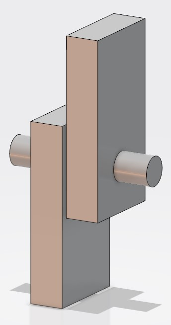
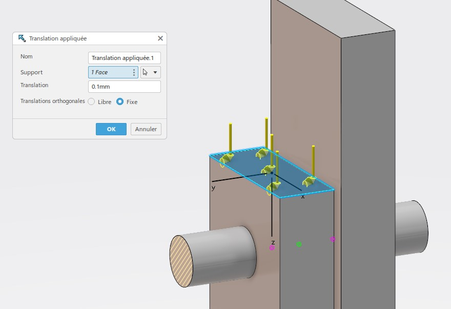
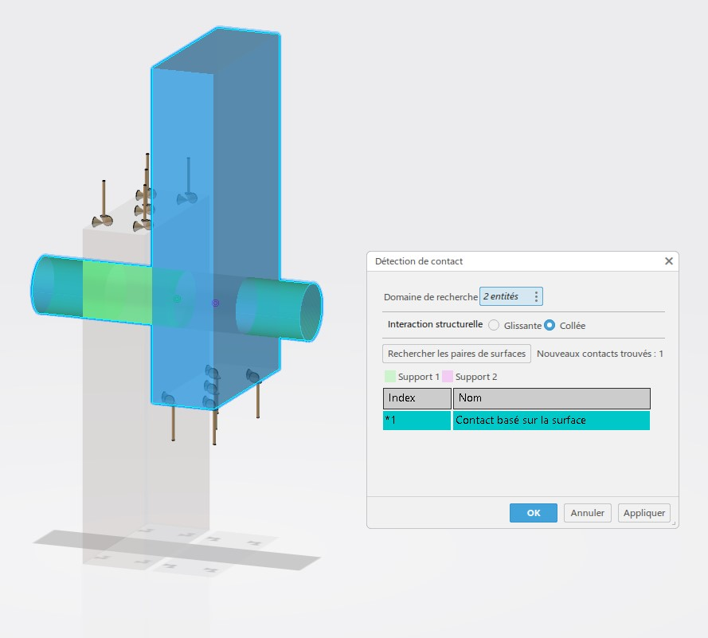
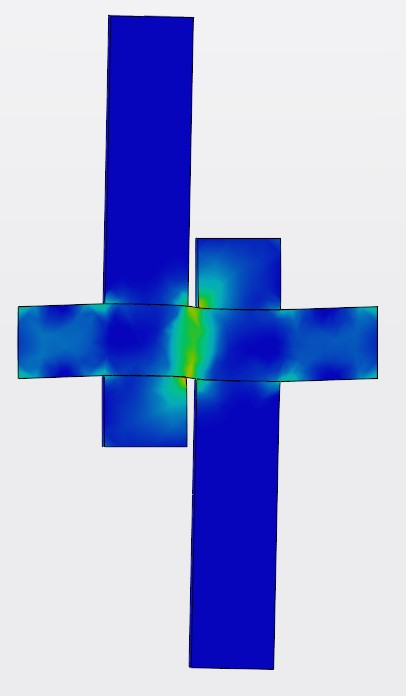

# TP 4 : Simulation FEM de cisaillement d’un goujon

## Objectif

Dans ce TP, vous allez mettre en pratique vos acquis précédents pour réaliser une étude de cisaillement sur un goujon cylindrique inséré entre deux brides. Vous devrez concevoir trois pièces différentes (deux brides et un goujon), les assembler, appliquer des déplacements simulant un cisaillement, et comparer les résultats FEM avec des calculs manuels réalisés dans un fichier Excel.

## Informations préliminaires

- Les pièces sont en **acier galvanisé**.
- Les brides possèdent un perçage destiné à accueillir le goujon cylindrique.
- L'espacement entre les deux brides est de **3 mm**.
- Sur chaque bride, un déplacement de **0,1 mm** sera imposé : l'une vers le haut, l'autre vers le bas, afin de créer un effet de cisaillement sur le goujon.
- Un plan de cotation est fourni.
- Des captures d'écran de l'assemblage des 3 pièces ainsi que le résultat élément fini attendu (sans les valeurs numériques) sont fournis dans le dossier d'accompagnement.

[Téléchargé le plan de cotation](./files/tp.rdm.pdf)

## Étapes du TP

### 1. Modélisation des pièces

Vous devez concevoir trois pièces distinctes en utilisant **Part Design** (ou l'outil de modélisation approprié) :

1. **Brides** :
   - Concevoir deux brides identiques avec un perçage central.
   - Préciser que les brides possèdent un perçage adapté pour accueillir le goujon.
   - Se référer au plan de cotation fourni pour les dimensions.
2. **Goujon cylindrique** :
   - Modéliser un goujon de forme cylindrique.
   - Le diamètre du goujon doit correspondre au perçage des brides.
   - La longueur du goujon doit être telle qu’il s’insère entre les deux brides respectant l’espacement de 3 mm.

{.center .img-small}

### 2. Assemblage des pièces

1. Passer à l'application **Assembly Design**.
2. Importer ou créer un nouvel assemblage comprenant les trois pièces :
   - Placer les deux brides de part et d’autre du goujon avec un espacement de **3 mm** entre elles.
   - Insérer le goujon dans les perçages des brides.
3. S’assurer que l’assemblage est correctement contraint et que le goujon est bien inséré entre les brides.

### 3. Attribution du matériau

1. Utiliser le matériau **acier galvanisé** que vous avez créé lors du TP précédent.
2. Appliquer ce matériau à chacune des pièces (les deux brides et le goujon).

### 4. Préparation de l’étude statique avec Static Study

1. Ouvrir l'application **Static Study**.
2. Créer une nouvelle étude statique pour l'assemblage.
3. Utiliser l'assistant de simulation pour guider la configuration de cette nouvelle étude.

### 5. Application des conditions aux limites et chargements

#### 1. Conditions aux limites

- Sur la première bride, imposer un déplacement de **0,1 mm vers le haut**.
- Sur la deuxième bride, imposer un déplacement de **0,1 mm vers le bas**.
  
Ces déplacements créent un cisaillement sur le goujon situé entre les brides.

{.center}

- Utiliser un encastrement pour figer les extremités du goujon.

### 2. Contact

- Créer 2 paires de contact entre les brides et le gonjons.

{.center}

### 3. Simulation

2. **Exécution de la simulation** : 
   - Lancer la simulation statique.
3. **Résultats** :
   - Une fois la simulation terminée, visualiser les résultats, notamment la distribution des contraintes selon le critère de Von Mises.
   - Vérifier la zone de cisaillement autour du goujon.

{.center}

### 7. Vérification et calculs complémentaires

1. **Calcul manuel** :
   - Réaliser un fichier Excel pour calculer la contrainte de cisaillement théorique sur le goujon.
   - Utiliser les dimensions des pièces, les déplacements imposés, et les propriétés de l'acier galvanisé pour effectuer ce calcul.
2. **Comparaison** :
   - Comparer la contrainte obtenue par calcul manuel avec celle fournie par le résultat de la simulation FEM.
   - Valider la simulation en s'assurant que les valeurs sont cohérentes.

### 8. Documents fournis et références

- **Plan de cotation** : Utilisez le plan de cotation fourni pour les dimensions des brides et du goujon.
- **Captures d'écran** : Consultez les captures d'écran fournies dans le dossier d'accompagnement pour l'assemblage des pièces et le résultat attendu.
- **Résultat élément fini attendu** : Une référence visuelle du résultat final (sans valeurs numériques) est disponible pour vous guider.

---

En suivant ces étapes, vous réaliserez une simulation FEM du cisaillement d’un goujon entre deux brides, tout en validant vos résultats par des calculs théoriques manuels. Cette activité consolide votre compréhension des analyses par éléments finis et de la mécanique des matériaux.
