# TP 1 : Prise en main de 3DExperience

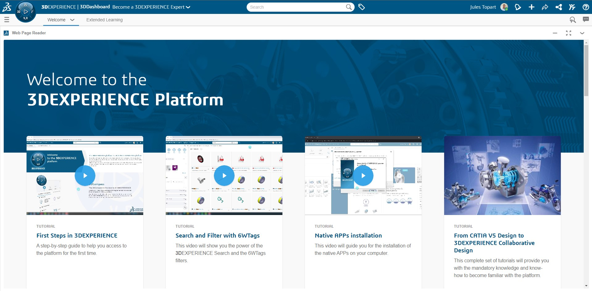

## Objectifs
Ce tutoriel a pour objectif de guider les étudiants dans la prise en main de la plateforme 3DExperience, depuis la découverte de son interface jusqu'à la conception d’une pièce simple intégrée dans un assemblage. Ce processus permet de comprendre les bases des outils collaboratifs et des environnements de modélisation 3D.

- [x] Découvrir l'interface de 3DExperience.
- [x] Naviguer dans les Dashboards et gérer les applications.
- [x] Créer un assemblage pour organiser un projet.
- [x] Concevoir une pièce simple à partir d'une esquisse.
- [x] Enregistrer correctement un projet dans l'espace collaboratif.

---

## Matériel et logiciel nécessaires
- Un ordinateur avec un accès à Internet.
- Accès à 3DExperience avec les rôles activés :
  - **Collaborative Engineering Expert**.
  - **Collaborative Simulation Expert**.

---

## Étape 1 : Découverte de l'interface 3DExperience

### 1.1 Interface principale

Après vous être connecté à 3DExperience, vous accédez à la page d'accueil, où un Dashboard par défaut vous est proposé. Cet espace contient des outils de documentation et sert de base pour personnaliser votre environnement de travail.

Voici les éléments principaux de l'interface, illustrés ci-dessous :

1. **Menu des Dashboards** : permet de gérer et de changer de Dashboard.
2. **Bouton d'Action (3Dx)** : accès aux applications.
3. **Barre de recherche** : pour trouver rapidement des projets ou des apps.
4. **Profil utilisateur** : gestion des préférences et des paramètres.
5. **Communautés (3DSwym)** et autres fonctionnalités collaboratives.

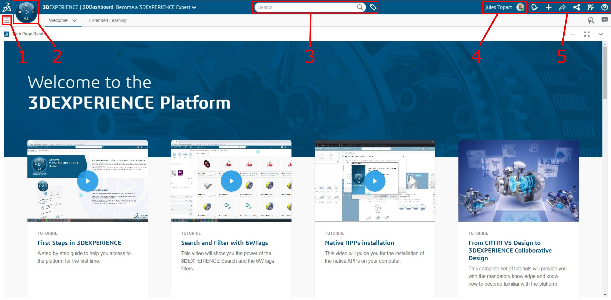

### 1.2 Gestion des Dashboards

Les Dashboards sont utiles pour organiser vos projets et outils. Cliquez sur le **menu des Dashboards** pour en gérer le contenu ou basculer entre plusieurs tableaux de bord.

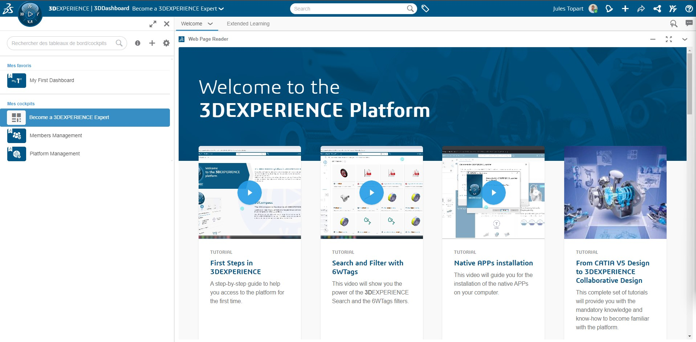

!!! info Conseil 
    En entreprise, il est fréquent d’avoir un Dashboard pour chaque projet ou rôle. Vous pourriez, par exemple, dédier un tableau aux conceptions mécaniques et un autre aux simulations.

---

## Étape 2 : Accéder aux applications

### 2.1 Le bouton d'action (3Dx)

Le bouton **3Dx** en haut à gauche de l'écran donne accès à toutes les applications de 3DExperience. Vous pouvez rechercher une application ou l’ajouter à vos favoris pour un accès rapide. Par exemple, **Assembly Design** et **Part Design** sont souvent utilisés ensemble dans des projets de conception mécanique.

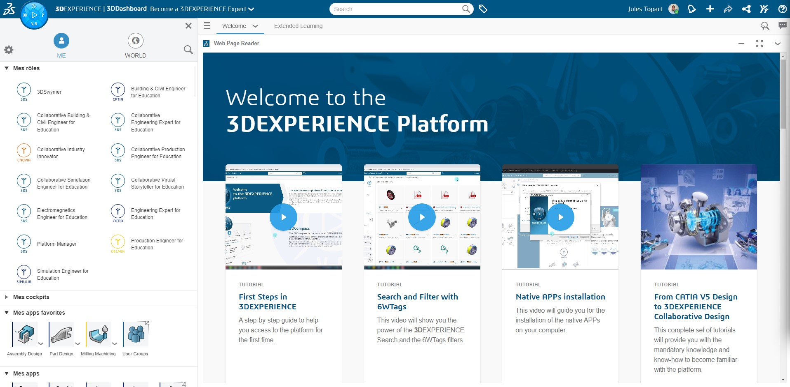

### 2.2 Différence entre applications locales et en ligne

Certaines applications, comme **Assembly Design**, s’exécutent localement pour des performances optimales, tandis que d’autres fonctionnent directement dans le navigateur. Voici une capture montrant une application locale. Bien que l'interface soit similaire, on remarque sur l'image ci-dessous l'ajout de la barre de menu Windows.

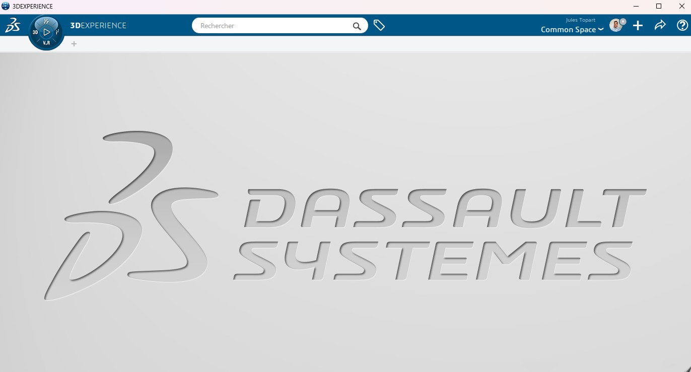

---

## Étape 3 : Création d'un assemblage

### 3.1 Ouvrir Assembly Design

Cliquez sur l’application **Assembly Design** pour ouvrir l’environnement dédié aux assemblages.

!!! info 
    Bien que **Part Design** puisse suffire pour concevoir une pièce unique, les projets industriels impliquent presque toujours des assemblages. 
    Commencer un projet en utilisant **Assembly Design** permet d’organiser directement toutes les pièces dans un même fichier, ce qui évite l’importation laborieuse de chaque composant par la suite. Dans un contexte professionnel, la conception d’assemblages est la norme. Cela facilite la gestion des relations entre pièces et l’analyse structurelle. Une bonne pratique consiste à créer toutes les pièces directement dans l’assemblage pour garantir une organisation cohérente.

---

### 3.2 Navigation dans l'arborescence de l'assemblage

L’arborescence (ou **Navigation Tree**) vous permet de gérer la structure de votre projet. Activez-la en cliquant sur la flèche grise à gauche de l’interface.

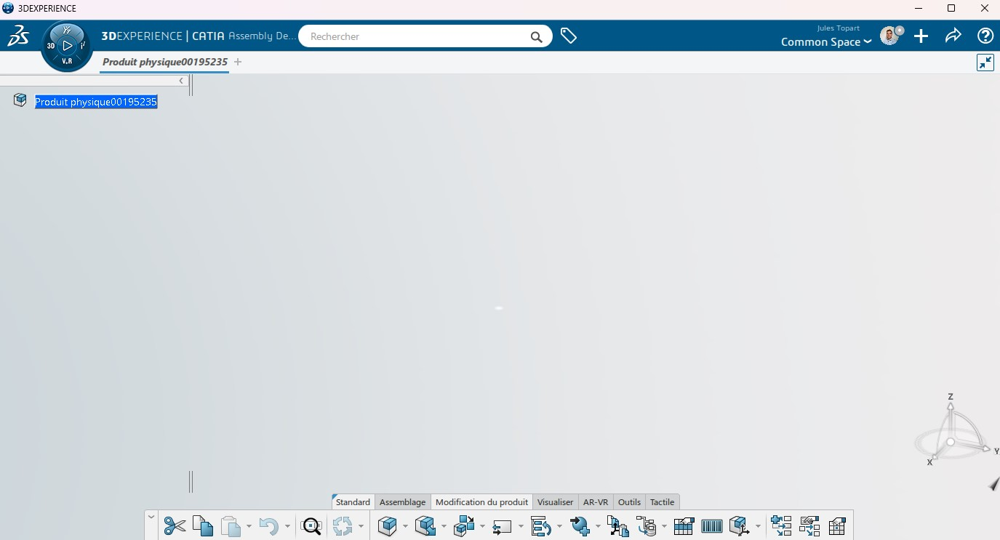

---

### 3.3 Ajouter une nouvelle pièce

Pour ajouter une nouvelle pièce dans l’assemblage :
1. Cliquez sur **Nouveau** dans le menu de l’assemblage.
2. Donnez un nom à la pièce et spécifiez son emplacement.

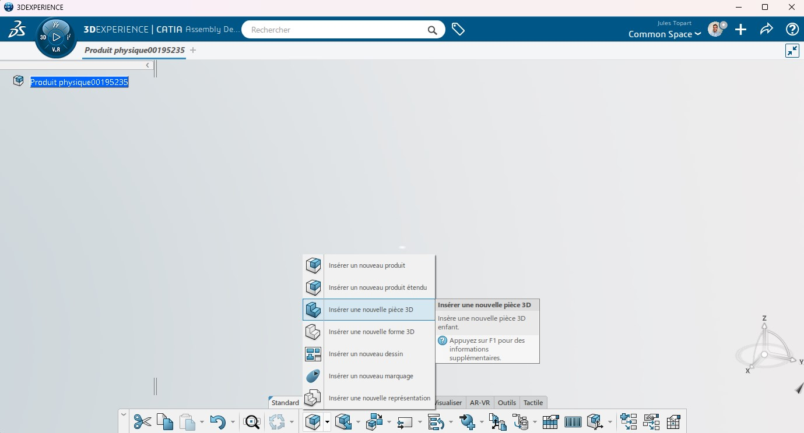

Une fois ajoutée, la nouvelle pièce apparaît dans l’arborescence. Déployez-la pour visualiser la structure complète.

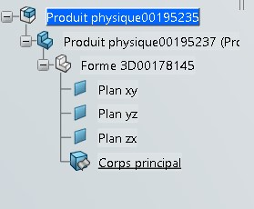

---

## Étape 4 : Conception d'une pièce simple

### 4.1 Ouvrir Part Design

Double-cliquez sur la pièce dans l’arborescence pour passer à l’environnement **Part Design**. Vous êtes maintenant prêt à modéliser la pièce.

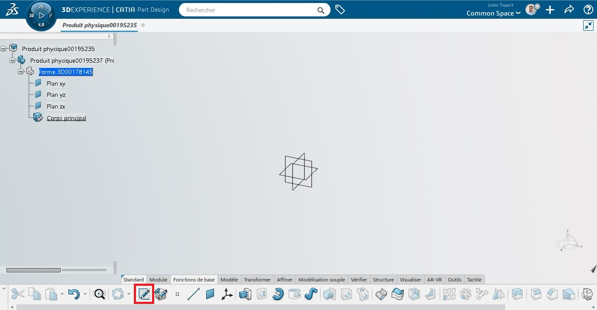

---

### 4.2 Dessiner une esquisse

L’esquisse est la base de toute pièce 3D. Utilisez l’application **Sketcher** pour dessiner un rectangle :
1. Sélectionnez un plan de référence, par exemple XY.
2. Tracez un rectangle simple.

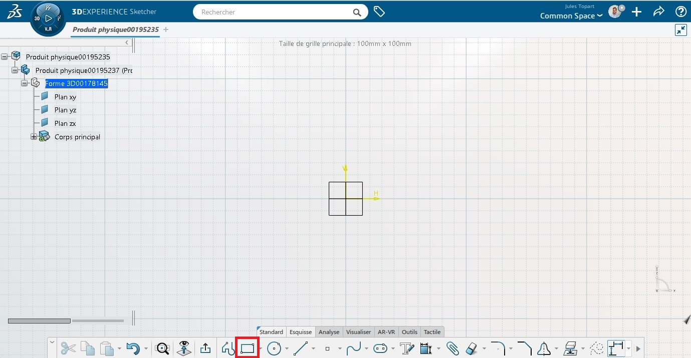  
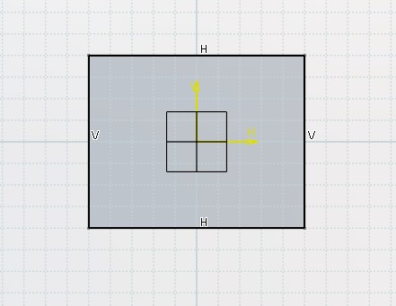

Ajoutez des dimensions pour spécifier les côtés.

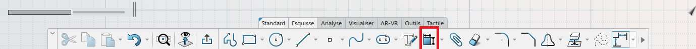

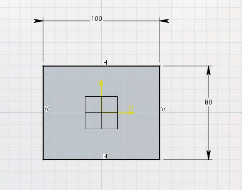

Si l’esquisse n’est pas entièrement contrainte (côtée), ajoutez des contraintes de position pour fixer sa localisation.

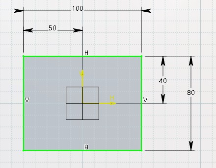

---

### 4.3 Extrusion

Une fois l’esquisse terminée, utilisez l’outil **Extrusion** pour générer un volume à partir de votre rectangle.

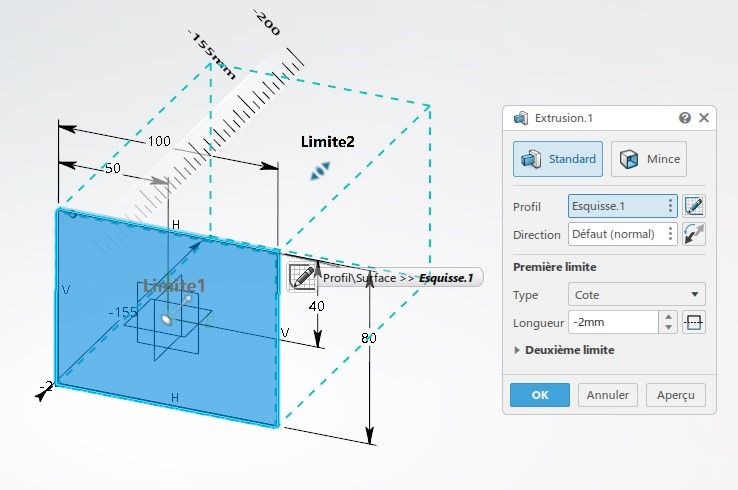

Vous obtenez ainsi votre première pièce 3D.

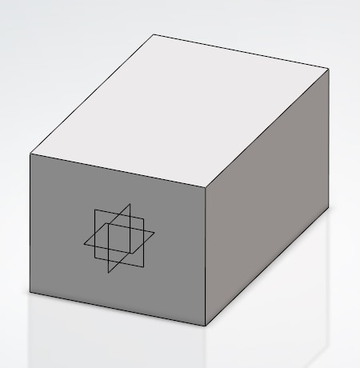

---

## Étape 5 : Enregistrement du projet

Avant d’enregistrer, assurez-vous de sélectionner le bon **espace commun (Common Space)** pour organiser vos fichiers. Enregistrez ensuite avec **Ctrl + S**.

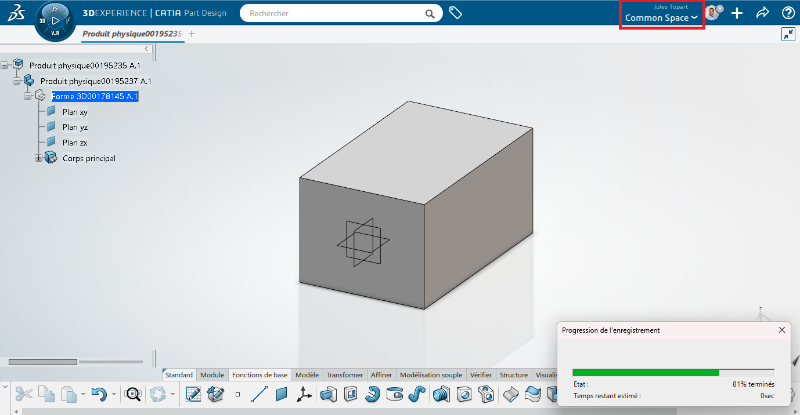

!!! info 
    Dans un projet collaboratif, bien nommer vos fichiers et les ranger dans les espaces appropriés permet d’éviter de perdre du temps à chercher des fichiers mal organisés.

---

## Étape 5 : Exercice

Réaliser la modélisation de la pièce suivante : 

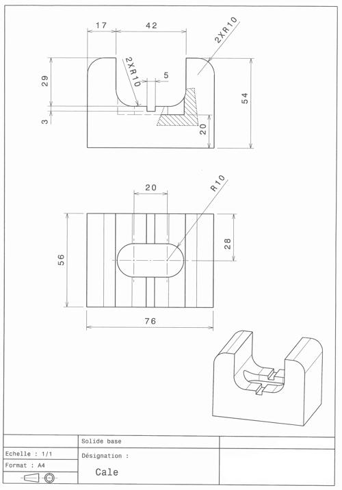