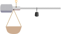

# TP 2 : Conception et dimensionnement d'une Balance romaine

{.center}

## Introduction

Dans ce TP, vous allez concevoir une balance romaine, un dispositif traditionnel permettant de mesurer avec précision des poids. Votre objectif est de concevoir un système capable de mesurer des masses allant de **0 à 30 kg** avec une graduation régulière, en utilisant un bras gradué, un contrepoids, une pièce intermédiaire pour le pivot, et un panier pour la pesée.

Vous commencerez par calculer et dimensionner les différents éléments de la balance en appliquant les principes de la statique. Ensuite, vous passerez à la modélisation des pièces dans **3DExperience** pour aboutir à une conception fonctionnelle et optimisée. À chaque étape, il sera essentiel d’ajuster vos calculs et vos choix pour maintenir l’équilibre du système.

---

## Étape 1 : Dimensionnement du bras gradué

Le bras gradué est l'élément principal de la balance. Il s'agit d'une tige cylindrique en acier (\(7.86 \, \text{g/cm}^3\)) de **diamètre 15 mm**. Ce bras doit inclure des graduations régulières correspondant aux masses à mesurer, par exemple **1 kg tous les 20 mm**. Vous commencerez par déterminer la longueur totale du bras.

### Calculs de la longueur et du poids

Pour garantir une lecture précise, vous devez d'abord définir la longueur totale du bras. Celle-ci doit inclure toutes les graduations nécessaires pour mesurer de **0 à 30 kg**, en prévoyant un espace supplémentaire après le pivot afin que les graduations ne soient pas masquées. Une fois la longueur définie, calculez le poids du bras en utilisant la densité de l'acier et la formule du volume d'un cylindre.

Prenez soin de noter vos calculs dans le tableur fourni. Ce dernier vous aidera à ajuster vos résultats si des modifications sont nécessaires au fil du TP.

### Modélisation du bras

Une fois les calculs terminés, ouvrez **3DExperience** et modélisez le bras gradué. Utilisez les dimensions calculées et ajoutez des repères visuels pour les graduations. Cette étape sera essentielle pour valider vos hypothèses dans les étapes suivantes.

---

## Étape 2 : Conception du contrepoids

Le contrepoids est l’élément clé pour équilibrer la balance. Il doit compenser non seulement le poids du bras gradué mais aussi celui du panier de pesée, qui pèse **500 g à vide**.

### Calcul du poids et choix des matériaux

Utilisez la relation d’équilibre statique pour déterminer le poids idéal du contrepoids. Prenez en compte la position des éléments sur le bras et appliquez la formule d’équilibre :

Choisissez un matériau adapté parmi ceux disponibles (acier, plomb) en tenant compte de la contrainte d’encombrement, fixée à \(25 \times 25 \times 10 \, \text{cm}\).

### Conception du contrepoids

Une fois le poids calculé, réfléchissez à une forme adaptée qui respecte les contraintes. Modélisez ensuite le contrepoids dans **3DExperience** et ajustez ses dimensions pour qu’il s’intègre harmonieusement au système.

---

## Étape 3 : Ajout de la pièce intermédiaire

La pièce intermédiaire joue un rôle central dans la balance. Elle supporte le pivot principal, permettant la rotation du bras, et accueille également l'attache du panier de pesée.

### Positionnement et conception

Commencez par déterminer la position idéale pour le pivot. Cette position doit être centrée sur la pièce pour simplifier les calculs. Ensuite, positionnez l’attache du panier de manière à garantir que les graduations sur le bras reflètent le poids réel des objets mesurés. Le panier doit compenser son propre poids à vide (500 g) à la graduation "0", et inclure ce poids dans la graduation "1 kg" (soit 1,5 kg en réalité).

Concevez la pièce intermédiaire dans **3DExperience** en intégrant ces éléments. Assurez-vous qu'elle est symétrique et que son centre de masse coïncide avec l’axe de rotation.

---

## Étape 4 : Assemblage et validation

Assemblez les différentes pièces (bras gradué, contrepoids, pièce intermédiaire, panier) dans **3DExperience**. Utilisez la simulation pour vérifier l’équilibre du système sous différentes charges. Si nécessaire, retournez à vos calculs pour ajuster les dimensions ou la position des éléments.

Utilisez le tableur pour valider vos hypothèses et simplifier les ajustements. Chaque modification doit garantir un équilibre parfait sur toute la plage de mesure.

---

## Consignes finales

À la fin de ce TP, vous devez fournir :

1. **Un modèle 3D complet** de la balance, intégrant toutes les pièces modélisées (Via le cloud 3DExperience).
2. **Un rapport de calculs** détaillant vos choix pour chaque élément (bras, contrepoids, pièce intermédiaire).
3. **Le tableur complété**, permettant de valider et ajuster les calculs d’équilibre.
4. **Une description des solutions techniques** apportées pour répondre aux contraintes.

Ce TP est une occasion d’appliquer vos connaissances en mécanique et en modélisation, tout en développant des compétences de conception précises et collaboratives.

**Bon courage !**
```