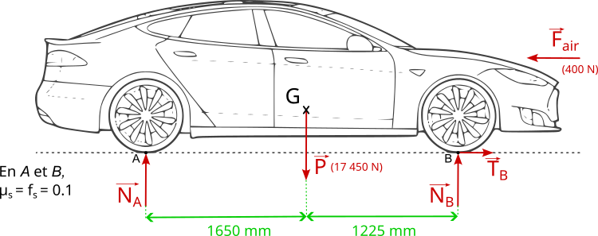
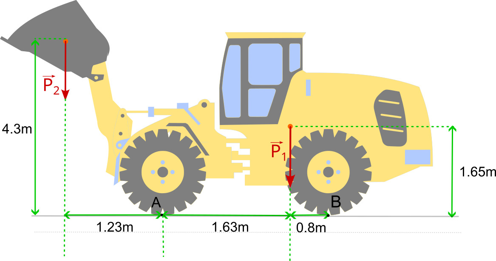

# Entrainement Examen

## I. Analyse statique

### Exercice 1 : Véhicule électrique

Dans cet exercice, nous étudierons la distribution des efforts dans un véhicule électrique. Le véhicule est supposée à l'arrêt. Vous pouvez donc ignorer $\vec{F_{air}}$ ainsi que les annotations lié aux frottements $\mu_s = f_s = 0.1$. Il n'y a donc aucun effort tangentiel dans cet exercice $T_B = 0$

Le poids total du véhicule est de $P = 17450N$. La position du centre de gravité est décrite sur le schéma ci-dessous. 

Question 1 : Calculez les valeurs des réaction au appui $A$ et $B$.
Question 2 : A votre avis, cette voiture est plutôt adapté à une poussée par propulsion ou par traction ? (Roue motrice à l'avant ou à l'arrière ?)

### Exercice 2 : Basculement d'un tractopelle

Dans cet exercice, nous étudierons le basculement d'un tractopelle. Le véhicule est supposée à l'arrêt. 

La masse de l'engin est de $12.5$ tonnes. La position du centre de gravité est décrite sur le schéma ci-dessous. Son godet transporte un chargement d'environ $5t$. 

Question 1 : Dans cette configuration, y a t-il un risque de basculement ?

Question 2 : Quel est la valeur maximum que peut transporter l'engin de chantier.

## II. Résitance des matériaux

