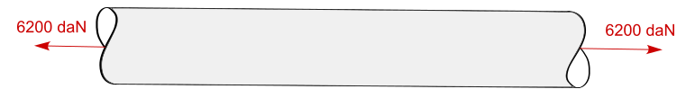

# Entrainement Examen

## I. Analyse statique

### Exercice 1 : Véhicule électrique

Dans cet exercice, nous étudierons la distribution des efforts dans un véhicule électrique. Le véhicule est supposée à l'arrêt.

!!! info 
    Vous pouvez donc ignorer $\vec{F_{air}}$ ainsi que les annotations lié aux frottements $\mu_s = f_s = 0.1$. Il n'y a donc aucun effort tangentiel dans cet exercice $T_B = 0$

Le poids total du véhicule est de $P = 17450N$. La position du centre de gravité est décrite sur le schéma ci-dessous. 

- **Question 1** : Calculez les valeurs des réaction au appui $A$ et $B$.
- **Question 2** : A votre avis, cette voiture est plutôt adapté à une poussée par propulsion ou par traction ? (Roue motrice à l'avant ou à l'arrière ?)

 
 
 
 
 
 
 
 

### Exercice 2 : Basculement d'un tractopelle

Dans cet exercice, nous étudierons le basculement d'un tractopelle. Le véhicule est supposée à l'arrêt. 

La masse de l'engin est de $12.5$ tonnes. La position du centre de gravité est décrite sur le schéma ci-dessous. Son godet transporte un chargement d'environ $5t$. 

- **Question 1** : Dans cette configuration, y a t-il un risque de basculement ?
- **Question 2** : Quel est la valeur maximum que peut transporter l'engin de chantier.

---

 
 
 
 
 
 
 
 
 
 
 
 
 
 
 
 

## II. Résitance des matériaux

### Exercice 3 : Contrainte et élongation d'une barre en acier

Dans le cadre d'un projet de construction métallique, une barre en acier est utilisée comme tirant dans une structure. Cette barre, de **2 mètres de longueur** et de **Ø25 mm de diamètre**, est soumise à une force de traction de **6200 daN** appliquée à chaque extrémité. Le matériau utilisé est un acier classique, dont les propriétés mécaniques sont les suivantes :  

- Module de Young : \( E = 210 \, \text{GPa} \)  
- Limite d’élasticité : \( R_e = 250 \, \text{MPa} \)  
- Coefficient de sécurité : \( s = 1.5 \)  

En tant qu’ingénieur, vous devez :  

1. Calculer la contrainte mécanique subie par la barre en fonction de la force appliquée et de la section transversale de la barre.  
2. Vérifier que cette contrainte est inférieure à la contrainte admissible, calculée à partir de la limite d’élasticité et du coefficient de sécurité.  
3. Si la contrainte admissible est dépassée, proposer un nouveau diamètre pour la barre afin d'assurer sa résistance tout en respectant les critères de sécurité.
4. Déterminer l’élongation de la barre sous l’effet de la traction, en tenant compte de ses nouvelles dimensions.  
   

 
 
 
 
 
 
 
 
 
 
 
 
 
 
 

### Exercice 4 : Étude de la déformation d’une barre en TPU

Dans le cadre de la conception d’un système flexible, une barre en **TPU 95A** (polyuréthane thermoplastique) est utilisée comme élément de liaison. La pièce est de forme cylindrique, avec un diamètre initial de **15 mm** et une longueur de **150 mm**. Elle est soumise à une force de traction de **50 N** appliquée à ses extrémités. Les propriétés mécaniques du matériau sont les suivantes :  

- Module de Young : \( E = 1 \, \text{MPa} \)  
- Coefficient de Poisson : \( \nu = 0.34 \)  

Votre mission est de :  

1. Calculer la contrainte subie par le cylindre en traction, en tenant compte de sa section transversale.  
2. Déterminer la déformation longitudinale du cylindre et l’allongement total de la pièce.  
3. Évaluer la réduction de diamètre causée par l’effet de Poisson, en fonction de la déformation longitudinale. 
